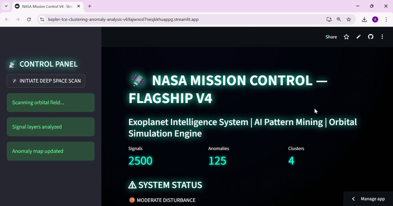
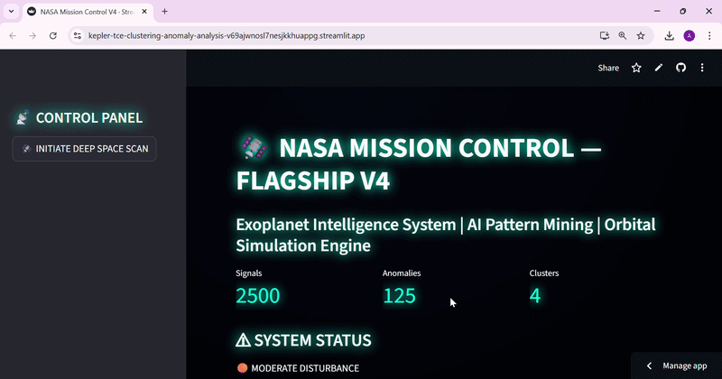

# 🛰️ NASA Mission Control — Exoplanet Signal Intelligence System

> AI-powered astrophysical intelligence platform for discovering hidden patterns, clusters, and anomalies in NASA Kepler exoplanet data.

---

## 🌌 Overview

This project simulates a **NASA-style mission control system** that applies machine learning techniques to real exoplanet detection data from the Kepler Space Telescope.

It transforms raw astrophysical signals into structured intelligence using clustering, anomaly detection, and dimensionality reduction — all visualized through a cinematic mission control dashboard interface.

The system integrates:
- Data Science
- Machine Learning
- Astrophysics-inspired analysis
- Interactive visualization

---
# Dashboard Link

https://kepler-tce-clustering-anomaly-analysis-v69ajwnosl7nesjkkhuappg.streamlit.app/

### 📸 Demo 1

### 📸 Demo 2

---

## 🚀 Key Features

### 🧠 AI Signal Intelligence Engine
- KMeans clustering for orbital signal grouping
- DBSCAN for density-based natural clustering
- Isolation Forest for anomaly detection

---

### 📊 Data Science Pipeline
- Data cleaning and feature selection
- Handling missing values
- Log transformation for skewed astrophysical distributions
- Standard scaling for ML preprocessing

---

### 🧬 Dimensionality Reduction
- PCA for 2D signal space projection
- Visualization of hidden orbital structure

---

### 📡 Statistical Analysis
- Hypothesis testing (SNR vs Transit Depth relationship)
- Feature importance analysis using Random Forest

---

### 🛰️ Mission Control UI (Streamlit)
- NASA-style glowing dashboard interface
- Live telemetry simulation (animated logs)
- Orbital signal field visualization
- Anomaly radar system
- System status monitoring (Stable / Disturbance / Active Scan)

---

## 📡 Dataset

- **Source:** NASA Kepler Object of Interest (TCE) Dataset
- **Size:** 34,032 samples
- **Features:** 113 astrophysical + instrument-derived parameters

### Includes:
- Orbital period
- Transit depth
- Transit duration
- Signal-to-noise ratio
- Detection pipeline metrics

---

## 🧪 Machine Learning Workflow

### 1. Data Preprocessing
- Removed metadata and non-physical features
- Handled missing values
- Applied log transformation to skewed features
- Standard scaling for ML compatibility

### 2. Feature Engineering
- Selection of key orbital and signal features
- Transformation of nonlinear distributions

### 3. Unsupervised Learning
- KMeans clustering (k=4)
- DBSCAN density-based clustering
- PCA projection for visualization

### 4. Anomaly Detection
- Isolation Forest model
- Detection of rare astrophysical events (~5% anomalies)

### 5. Statistical Testing
- T-test: relationship between SNR and transit depth
- Random Forest feature importance analysis

---

## 📊 Key Insights

- Exoplanet signals form structured orbital clusters
- Orbital period is the strongest driver of structural patterns
- A small subset of signals represent high-intensity anomalies
- The dataset reflects real astrophysical noise and complexity

---

## 🧠 Scientific Interpretation

The dataset behaves as a **latent astrophysical signal field**, where:

- Dense clusters → stable planetary systems  
- Sparse regions → rare or anomalous cosmic events  
- PCA reveals hidden orbital geometry  
- Machine learning models uncover non-obvious astrophysical structure  

---

## 🛰️ Dashboard Features

The Streamlit mission control interface simulates a NASA operations system featuring:

- 📡 Live telemetry feed (simulated streaming logs)
- 🪐 Orbital signal field visualization
- 🧠 PCA intelligence grid
- 🚨 Anomaly radar system
- 📊 Cluster analysis panels
- ⚠ System status indicators (Stable / Disturbance / Scan Mode)
- 🌌 NASA-inspired glowing HUD interface

---

## ⚙️ Tech Stack

- Python
- Pandas, NumPy
- Scikit-learn
- Matplotlib
- PCA, KMeans, DBSCAN, Isolation Forest
- Streamlit

---

## 📈 Results Summary

- 4 distinct signal clusters identified
- ~1700 anomalies detected (~5% of dataset)
- Silhouette Score: ~0.56 (moderate clustering quality)
- Strong statistical relationship between signal strength and transit depth

---

## 🪐 Future Improvements

- Real-time NASA API integration
- 3D orbital simulation engine
- Deep learning-based anomaly detection
- Interactive space visualization environment
- Cloud deployment (Streamlit Cloud / AWS)

---

## 🌠 Author

Built as a **space intelligence + AI portfolio project**, combining:

- Astrophysics-inspired machine learning
- NASA dataset analysis
- Data visualization systems
- Interactive simulation dashboard design

---

## 🚀 Conclusion

This project demonstrates how raw astronomical data can be transformed into an intelligent simulation system that uncovers hidden structure in the universe using machine learning.

> “We are not just analyzing data — we are decoding the architecture of space itself.”
