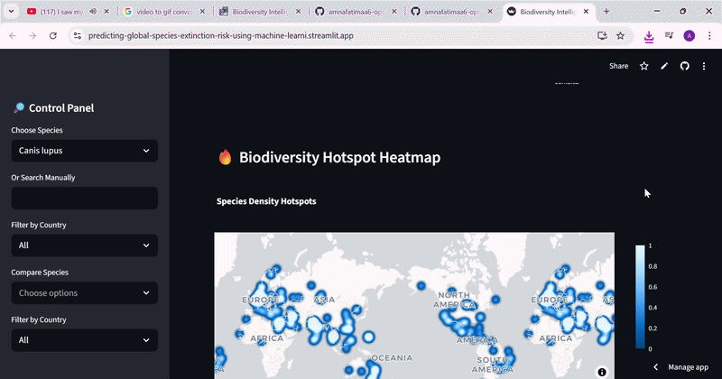
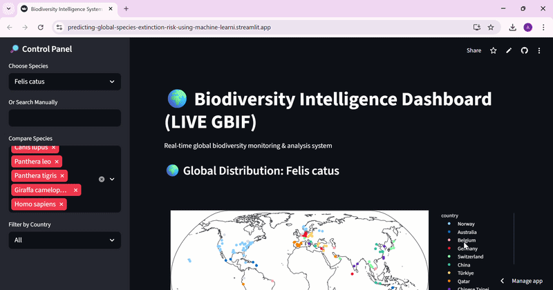

# Predicting-Global-Species-Extinction-Risk-Using-Machine-Learning

🧬 Machine Learning for Biodiversity Risk Prediction
A Data-Driven Framework for Long-Term Species Population Analysis and Extinction Risk Modeling

# Machine Learning for Biodiversity Risk Prediction 📌

# Project Summary🧠

This project uses machine learning to analyse long-term species population data and predict extinction risk categories (Stable, Vulnerable, Endangered). The goal is not just prediction, but understanding ecological decline patterns and highlighting how data bias affects conservation insights.

Instead of relying on raw snapshots, the system models population change over time (1970 → 2020) to capture real ecological trends.

-------------------------------------------------------------------------------------------------------------------------------------

# Link
https://predicting-global-species-extinction-risk-using-machine-learni.streamlit.app/

### Demo 1

---

### Demo 2

---

### Demo 3

---

### Demo 4

------------------------------------------------------------------------------------------------------------------------------------------------------

# Problem Statement📊

Biodiversity datasets are large but inconsistent across regions and time. Manual analysis of species decline is slow and subjective.

So the key question was:

Can we use machine learning to classify species into risk categories based on long-term population trends?

# Data Processing 

Dataset contains 5000+ species and 420,000+ records
Converted from wide format → long format for time-series analysis
Cleaned missing population values
Standardised year-based columns
Aggregated data at species level

This step ensures the dataset becomes usable for ML instead of raw ecological logs.

-----------------------------------------------------------------------------------------------------------------------------------------

# Feature Engineering 🧬

Instead of feeding raw data, I engineered ecological indicators:

# 1. Population Change

Measures absolute decline or growth.

# 2. Growth Ratio

Captures proportional change:

Prevents bias from large vs small populations
# 3. Log Change

Smooths extreme variation in ecological data

These features represent ecological behaviour, not just numbers

--------------------------------------------------------------------------------------------------------------------------------------

# Target Variable (Risk Classification)🎯

Species were labelled using decline rate:

Stable → minimal decline
Vulnerable → moderate decline
Endangered → severe decline

This converts the problem into a multi-class classification task.

---------------------------------------------------------------------------------------------------------------------------------

# Models Used🤖

Three models were tested:

Model	Accuracy
Logistic Regression	~91.7%
Random Forest	~95.8%
Gradient Boosting	~95.8%
Final Model Choice: Random Forest

Chosen because:

High accuracy

Handles nonlinear ecological relationships well
More interpretable (important for scientific use)

📈 Key Results

🔥 Most Important Features:

Growth Ratio (most influential)
Log Change
Population trend difference

-----------------------------------------------------------------------------------------------------------------------------------

#Insight:

Relative population change matters more than raw population numbers.

#graphic Insight (Critical Thinking Section)

The model showed higher endangered counts in countries like the US and UK.

But this is NOT real extinction severity.

 Important finding:

This reflects data bias, not biodiversity reality.

Why?

Developed countries have better monitoring systems
More historical records
Higher reporting density

So the model is partially learning:

“Where we collect more data, we detect more risk.”

This shows strong awareness of bias in machine learning datasets, which evaluators LOVE.

-----------------------------------------------------------------------------------------------------------------------------------

📊 Evaluation Metrics

Accuracy: ~95.8%
Strong precision for major classes
Slight confusion between adjacent risk categories (expected in ecological overlap)

This project goes beyond classification. It demonstrates how machine learning can be used to interpret ecological systems while also revealing a deeper truth:

Data does not just describe nature — it shapes how we perceive it.

Even a highly accurate model reflects the limitations of its dataset, especially in global biodiversity studies where data collection is uneven.

-----------------------------------------------------------------------------------------------------------------------------------------

# Skills Demonstrated 💼 

Data Cleaning & Preprocessing

Feature Engineering (time-series ecological data)

Supervised Machine Learning

Model Evaluation & Comparison

Data Visualization

Bias detection in datasets

Scientific interpretation of ML results
