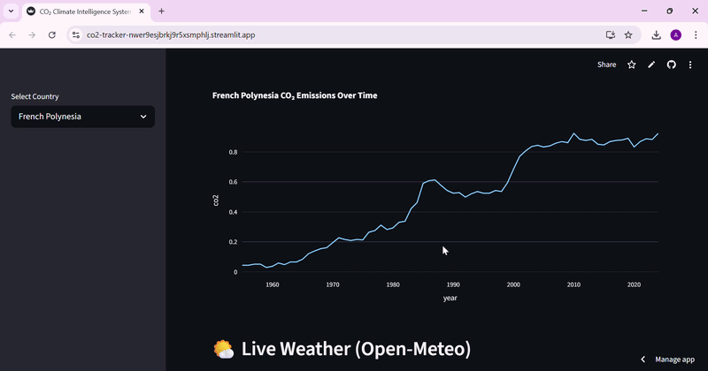
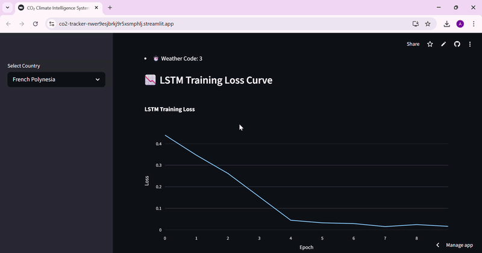
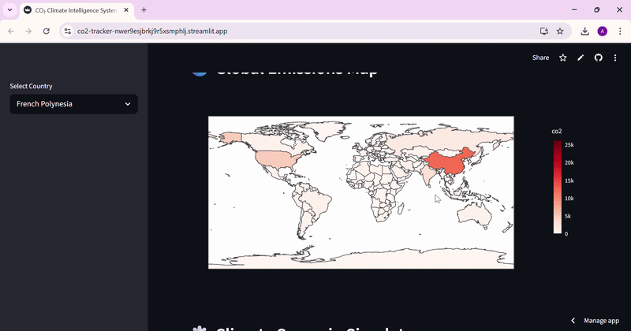

# 🌍 CO₂ Climate Intelligence System
## Machine Learning vs Deep Learning for Climate Forecasting
--------------------------------------------------------------------------------------------------------------------------------------------------------------------------------

📌 Overview

The CO₂ Climate Intelligence System is an AI-powered climate analytics platform designed to analyze global carbon emissions and evaluate forecasting performance between classical machine learning and deep learning models under real-world constraints.

The system integrates:

----------------------------------------------------------------------------------------------------------------------------------------------------------------------------------

📊 Historical CO₂ emissions analysis

🤖 Machine Learning (Linear Regression baseline)

🧠 Deep Learning (LSTM model)

🌤️ Real-time weather data (Open-Meteo API)

🌍 Global emissions visualization

⚙️ Climate scenario simulation

🎯 Research Objective

This project investigates how model complexity interacts with dataset size and structure in climate time-series forecasting.

It specifically evaluates whether deep learning models (LSTM) outperform classical machine learning models (Linear Regression) in CO₂ emissions prediction under limited data conditions.

----------------------------------------------------------------------------------------------------------------------------------------------------

🚀 Live Demo

https://co2-tracker-nwer9esjbrkj9r5xsmphlj.streamlit.app/

 
### Demo 1

---

### Demo 2

---

### Demo 3

---------------------------------------------------------------------------------------

🧪 Experimental Setup

Dataset: CO₂ emissions data from Our World in Data

Problem Type: Time-series forecasting

Preprocessing:

Normalization / scaling

Feature engineering (lag features, trend features)

Validation Method: Chronological train-test split (no data leakage)

-----------------------------------------
Models:       
-----------------------------------------
Linear Regression (baseline ML model)
-----------------------------------------
LSTM (sequence-based deep learning model)
-----------------------------------------
Evaluation Metrics:
-----------------------------------------
MAE (Mean Absolute Error)
-----------------------------------------
RMSE (Root Mean Squared Error)
-----------------------------------------

🧠 Key Research Findings

📌 Finding 1: Simpler models can outperform deep learning

Linear Regression consistently achieved lower prediction error than LSTM across multiple CO₂ datasets.

Evidence:

Lower MAE and RMSE for Linear Regression
Higher variance and instability in LSTM predictions

Implication:
Model complexity does not guarantee superior performance in structured, low-noise datasets.

📌 Finding 2: Data scale is a critical limitation

LSTM underperformed due to limited dataset size (~76–165 time steps depending on country).

Implication:

Deep learning models require significantly larger datasets to generalize effectively.

📌 Finding 3: Feature engineering dominates model complexity

Engineered temporal features (lags and trends) significantly improved Linear Regression performance.

Implication:

In structured time-series problems, feature quality can outweigh model architecture complexity.

---------------------------------------------------------------------------------------------------

📊 Model Comparison Results
Model	MAE	RMSE
Linear Regression	1.63	2.11
LSTM	10.78	11.87

-------------------------------------------------------------------------------------------------------

📉 Evaluation Components

The system evaluates:

Forecast accuracy (MAE / RMSE)
Training loss convergence (LSTM)
Prediction stability over time
Forecast divergence analysis
🌤️ Real-Time Weather Integration

The system integrates Open-Meteo API (no API key required) to provide live atmospheric context:

🌡️ Temperature
🌬️ Wind speed
🧭 Wind direction
🌍 Geographic weather mapping

This adds environmental context to emissions analysis.

----------------------------------------------------------------------------------------------------------------------------------------------------------

🌍 Global Visualization 

Choropleth world map of CO₂ emissions
Country-wise emission comparison
Emission intensity visualization
⚙️ Climate Scenario Simulator

Users can simulate:

📉 Emission reduction percentage

🔮 Future CO₂ trajectory changes

🌍 Policy impact scenarios

🧠 AI Insights

Global CO₂ emissions show a persistent upward trend
Data exhibits low to moderate volatility
Linear patterns dominate most country-level datasets
Deep learning introduces complexity without guaranteed performance gain in low-data regimes
Real-time weather adds contextual environmental correlation

----------------------------------------------------------------------------------------------------------------------------------------------------------

🛠️ Tech Stack

Python 🐍
Streamlit 📊
Pandas / NumPy
Scikit-learn 🤖
TensorFlow / Keras 🧠
Plotly 🌍
Open-Meteo API 🌤️

------------------------------------------------------------------------------------------------------------------------------------------------------------

📁 Project Structure
CO2-Climate-Intelligence-System/
│
├── app.py
├── model/
│   └── lstm_forecast.py
├── requirements.txt
└── README.md
🚀 How to Run
pip install -r requirements.txt
streamlit run app.py

-----------------------------------------------------------------------------------------------------------------------------------------------------------------------

🧪 Scientific Interpretation

This project demonstrates that:

Model performance in climate forecasting is not determined by complexity alone, but by alignment between data structure, feature engineering, and model assumptions.

In low-data, low-noise, and near-linear regimes, classical models can outperform deep learning architectures.

-----------------------------------------------------------------------------------------------------------------------------------------------------------------------------

🎓 Academic Value

This project demonstrates:

Real-world climate data analysis 

Classical ML vs Deep Learning comparison

Time-series forecasting techniques

Feature engineering impact analysis

Real-time API integration

Experimental evaluation methodology

----------------------------------------------------------------------------------------------------------------------------------------------------------

🧭 Future Improvements

Add Transformer-based forecasting models

Integrate NASA / Copernicus climate datasets

Add anomaly detection for emission spikes

Expand LSTM with larger temporal datasets

Add climate risk scoring system

----------------------------------------------------------------------------------------------------------------------------------------------------------

🏁 Conclusion

This system demonstrates a key principle in applied machine learning:

More complex models are not inherently better — performance depends on data structure, scale, and feature quality.

It combines data science, machine learning, deep learning, and real-time systems into a unified climate intelligence framework.

----------------------------------------------------------------------------------------------------------------------------------------------------------

💡 Final Note

🟢 Designed as a scholarship-ready AI research prototype

🟢 Suitable for data science portfolio evaluation

🟢 Demonstrates real-world ML vs DL empirical analysis
