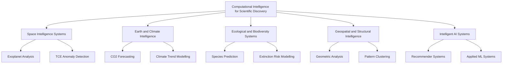

# Computational Intelligence & Scientific AI Lab

## 👤 Research Profile

I am an undergraduate Computer Science student from Pakistan with a research-oriented focus in Artificial Intelligence, Machine Learning, and Data Science, developed through self-directed study, applied experimentation, and interdisciplinary exploration.

My work is driven by a central question:

How can machine learning be used to uncover hidden structure in complex, high-dimensional, and noisy scientific data?

My preparation includes:

Independent completion of advanced AI/ML coursework
Continuous engagement with scientific literature and research papers
Development of end-to-end machine learning systems
Participation in applied AI challenges and technical projects
Research-style documentation of experimental work

---

## 🎯 Academic and Research Objective

My academic trajectory is centered on:

Computational Intelligence for Scientific Discovery

I focus on the application of AI to model, analyse, and interpret complex natural systems, where traditional analytical methods are often insufficient.

Core Areas of Interest:
🌌 Astrophysical Data Intelligence
🌍 Earth System & Climate Intelligence
🧬 Ecological and Biodiversity Modelling
🧠 Pattern Discovery in High-Dimensional Data Systems

My work explores how machine learning can move beyond prediction to:

detect anomalies
identify latent structures
model dynamic systems
support scientific inference

I am actively engaged in studying these domains to develop a strong interdisciplinary foundation that integrates machine learning with scientific discovery and computational modelling.

---

## 🧭 Research Domain Architecture

---

## Research Domains & Project Work

This repository is structured as a collection of domain-focused research modules.

## 🛰️ Space Intelligence Systems

Application of unsupervised learning and anomaly detection techniques on astrophysical datasets (e.g., Kepler TCE data) to identify non-obvious orbital patterns and signal irregularities.

## 🌍 Climate & Earth System Intelligence

Comparative modelling of CO₂ emission trends using classical machine learning and deep learning approaches to analyse long-term environmental dynamics under real-world constraints.

## 🧬 Biodiversity & Ecological Intelligence

Machine learning models for predicting species population decline and extinction risk, with additional analysis of dataset bias in global ecological reporting systems.

## 🏛️ Geospatial & Structural Intelligence

Exploration of geometric and spatial patterns in historical and archaeological datasets using clustering and unsupervised learning techniques.

## 🎬🎧 Intelligent Recommender Systems

Development of hybrid recommendation systems integrating:

NLP (Transformer-based embeddings)
user interaction modelling
audio feature engineering

## 🏠📊 Applied Machine Learning Systems

Implementation of real-world predictive systems, including:

Real estate price prediction
Financial time-series forecasting
Transformer-based news classification

These systems demonstrate applied machine learning under practical constraints and diverse data modalities.

---

## 📄 Research Contributions & Academic Work

All major projects are accompanied by research-style documentation, including:

Problem formulation

Dataset description

Methodology and model design

Evaluation metrics and performance analysis

Observations, limitations, and future directions

These reports are designed to reflect early-stage academic research standards, emphasizing:

clarity

reproducibility

analytical depth
---

## 📁 Repository Structure

The repository is organized to reflect a structured progression across domains and applied research areas:

## 📦 Portfolio Repository

├── 01_Space_Intelligence/

├── 02_Earth_System_Analysis

├── 03_Geospatial_Intelligence/

├── 04_Recommender_Systems/

├── _Internship_Projects/

├── _Documentation_Research_Papers

📚 Documentation & Research Papers

This section includes:

Project research papers
Technical reports and evaluations
Question–answer style analysis documents
Model performance discussions and interpretations

These documents provide a deeper scientific perspective on each project beyond implementation.

---

## 🧠 Technical Competencies

Machine Learning (Supervised & Unsupervised Learning)

Deep Learning (LSTM, Transformer-based NLP)

Data Preprocessing and Feature Engineering

Time-Series Analysis and Forecasting

Dimensionality Reduction (PCA)

Clustering and Anomaly Detection

Model Evaluation and Statistical Analysis

Deployment using Streamlit and API integration

---

## 🚀 Research Vision

This work represents an ongoing effort to develop AI systems capable of contributing to scientific discovery across domains.

My long-term goal is to:

build computational frameworks that enable the discovery of meaningful patterns in complex natural systems, supporting research in space science, environmental modelling, and beyond.

---

## 🌱 Closing Statement

This repository reflects a progression from applied machine learning toward research-oriented AI development, shaped by independent learning, interdisciplinary curiosity, and sustained experimentation.

It is intended as a foundation for future academic work in Artificial Intelligence for Scientific Research.
