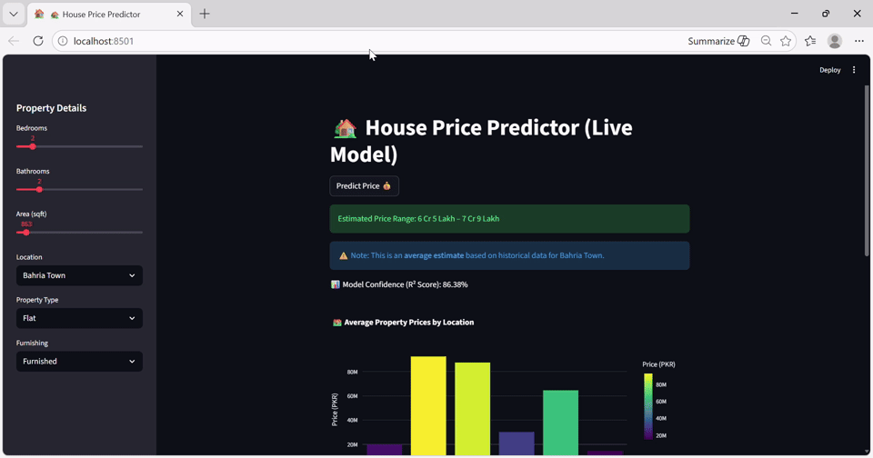
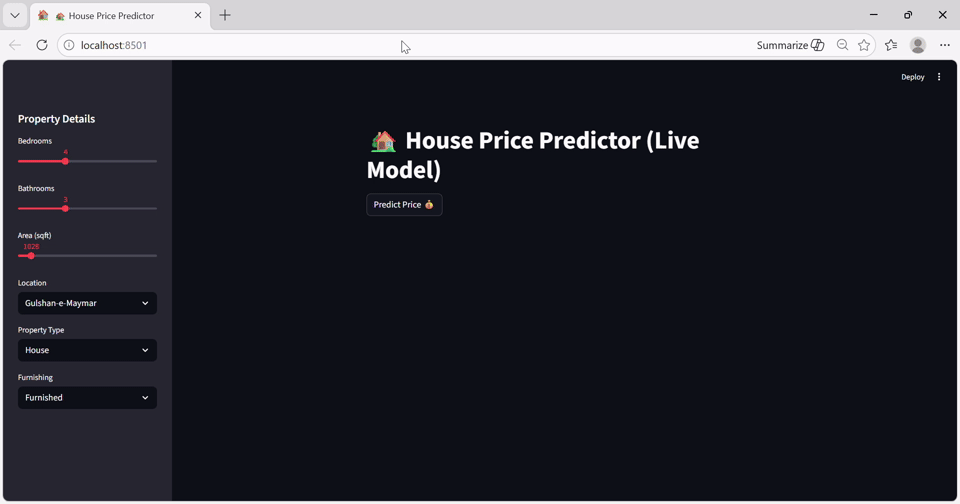

# 🏡 House Price Prediction System (Karachi Real Estate)

## 🚀 Live Demo

👉 **Try the app here:**
🔗 https://housingpricekarachi-n429dxgachb4ndf3c4zqwh.streamlit.app/

---

## 🎥 Demo Preview

### 🧠 App in Action

---


---



---




---

## 📌 Overview

This project builds a complete **machine learning pipeline** to predict house prices in Karachi using real-world housing data. It includes **EDA, feature engineering, multiple ML models, and a deployed interactive app using Streamlit.**

---

## 📊 Dataset

This dataset was independently compiled through manual research of publicly available real estate listings across major residential areas in Karachi.

### Features:

* Property Type (House / Flat)
* Bedrooms
* Bathrooms
* Area (sqft)
* Location
* Furnishing Status
* Price (PKR)

---

## 🔍 Exploratory Data Analysis (EDA)

### Key Insights:

* Houses are more expensive than flats (space + privacy)
* Location heavily influences pricing
* Price distribution is highly skewed
* Furnished homes are generally more expensive

---

## 🧠 Feature Engineering

* One-hot encoding for categorical variables
* Created:

  * `price_per_sqft`
  * `total_rooms`
* Log transformations:

  * `log_price`
  * `log_area`
* Standardization using `StandardScaler`

---

## 🤖 Models Used

### Linear Regression

* R²: 0.78 – 0.83
* Struggles with non-linear patterns

### Decision Tree

* R²: 0.86
* Captures non-linearity

### Random Forest ⭐ (Best)

* R²: **0.959**
* Best performance + stability

---

## 📈 Model Comparison

| Model             | R² Score    |
| ----------------- | ----------- |
| Linear Regression | 0.78 – 0.83 |
| Decision Tree     | 0.86        |
| Random Forest     | **0.959**   |

---

## ⚙️ Web App Features

* Interactive user inputs:

  * Bedrooms, Bathrooms, Area
  * Location
  * Property type
  * Furnishing status
* Predicts:

  * Price range
  * Model confidence
* Includes:

  * Visual analytics
  * Location-based insights

---

## 📁 Project Structure

```
house-price-prediction/
│
├── data/
│   └── House_prices.csv
│
├── notebooks/
│   └── EDA_and_Model_Development.ipynb   
│
├── app/
│   ├── app.py
│   └── model.py
│
├── images/
│   └── demo gifs
│
└── README.md
```

---

## 📊 Feature Importance (Random Forest)

Top predictors:

1. Price per sqft
2. Area
3. Location

---

## ⚠️ Limitations

* Small dataset (~189 entries)
* Possible overfitting
* Limited geographic coverage

---

## 🔮 Future Improvements

* Add more data
* Use XGBoost / LightGBM
* Deploy with database
* Add time trends

---

## 🧑‍💻 Tech Stack

* Python
* Pandas, NumPy
* Scikit-learn
* Matplotlib, Seaborn
* Plotly
* Streamlit

---

## ✨ Final Note

This project demonstrates a full **end-to-end ML workflow** — from data collection to deployment — focused on real-world property pricing in Karachi.
