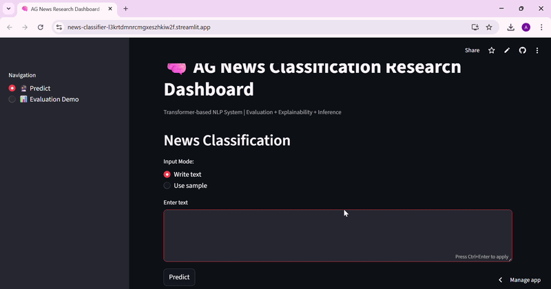

# News-Classifier

🧠 AG News Classification Research Dashboard

A lightweight, research-focused NLP dashboard built using Transformer models to classify news articles into predefined categories.

This project demonstrates real-world NLP inference, model evaluation, and interactive prediction using a clean and minimal UI.

### 📸 App Demo 1

https://news-classifier-l3krtdmnrcmgxeszhkiw2f.streamlit.app/

📌 Overview

This application uses a fine-tuned BERT model to classify news text into four categories:

🌍 World

⚽ Sports

💼 Business

🤖 Sci/Tech

It is designed as a research + portfolio project, showcasing how modern NLP systems are deployed and evaluated.

🚀 Features

🔮 1. News Prediction

Input custom text or use sample data
Real-time classification using a Transformer model
Confidence score display
Top predictions with probabilities
Visual probability distribution chart

📊 2. Evaluation Demo

Simulated evaluation metrics
Accuracy score
Classification report
Confusion matrix visualization

(Note: Demo uses random data for lightweight deployment purposes)

🧠 Model Details

Model: textattack/bert-base-uncased-ag-news

Architecture: BERT (Transformer-based)

Task: Multi-class Text Classification

Framework: PyTorch + Hugging Face Transformers

🛠️ Tech Stack 

Frontend/UI: Streamlit

Modeling: Hugging Face Transformers

Backend: PyTorch

Data Handling: Pandas, NumPy

Visualization: Matplotlib, Seaborn

📂 Project Structure
├── app.py  
# Streamlit dashboard

├── train.py     
# Model training & evaluation script

├── model/     
# Saved trained model

├── tokenizer/   
# Saved tokenizer

└── README.md   
# Project documentation

🎯 Use Case

This project is ideal for:

NLP beginners learning Transformers
Students building AI/ML portfolios
Demonstrating model deployment skills
Research demos and academic submissions

⚠️ Limitations
Evaluation demo uses synthetic data
Model performance depends on pretrained weights
Not optimized for large-scale production

🔮 Future Improvements
Add SHAP explainability
Real dataset evaluation in dashboard
Deploy on cloud (Streamlit Cloud / Hugging Face Spaces)
Add attention visualization

👩‍💻 Author

Built with focus on practical NLP and real-world AI deployment.
